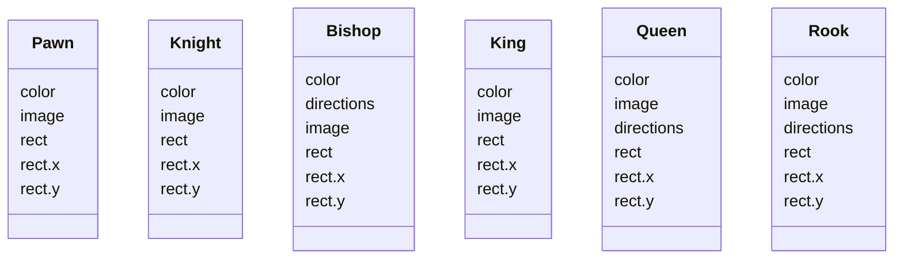
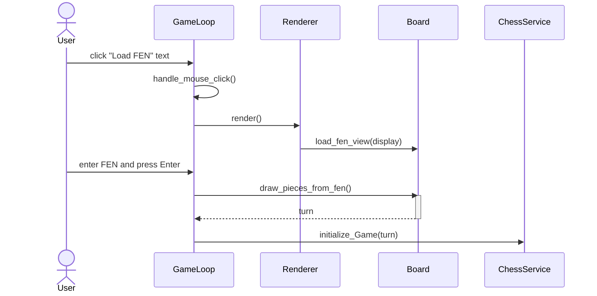
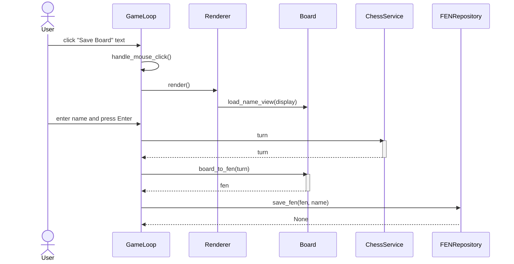
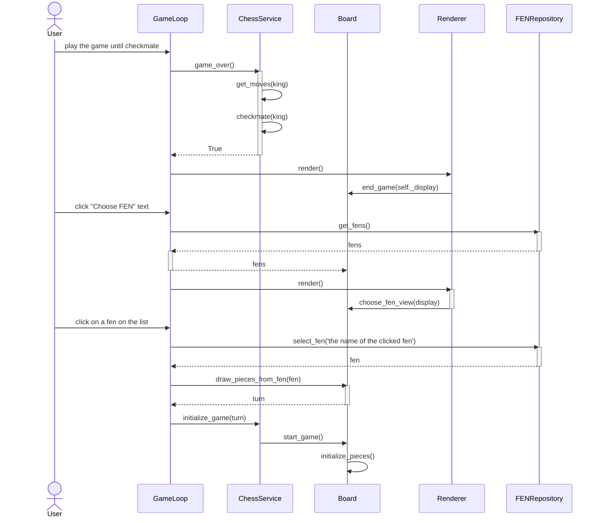

# Arkkitehtuurikuvaus

## Rakenne

Projektilla on seuraavanlainen pakkausrakenne:


Pakkaus _ui_ sisältää käyttöliittymän koodin, _services_ sovelluslogiikan koodin ja _repositories_ tietojen tallennuksesta vastaavan koodin. _sprites_ pakkaus sisältää luokat pelissä tarvittaville nappuloille, ja _assets_ pakkaus sisältää kuvat, joista nappulat piirretään. 

## Käyttöliittymä

Sovelluksen käyttöliittymän eri näkymiä ovat:
  - Alkunäkymä
  - FEN-asetelman syöttäminen
  - FEN-asetelman valitseminen
  - Pelinäkymä
  - FEN-asetelman tallentaminen
  - Pelin päättyminen

Näkymät ovat toteutettu ```Board```-luokassa. FEN-asetelman valitsemisnäkymä on osana alku- ja pelin päättymisnäkymää ja asetelman tallennus on osana pelinäkymää, muuten näkymät ovat näkyvillä yksi kerrallaan. Käyttöliittymä on pyritty pitämään erillään sovelluslogiikasta niin, että se vain kutsuu ```ChessService```- ja ```FENRepository```-luokkien metodeja. 

### Sovelluslogiikka

Pelin nappuloita kuvaavat Pygamen Sprite-luokan perivät luokat _Pawn_, _Knight_, _Bishop_, _King_, _Queen_ ja _Rook_:



Pelin logiikasta vastaa luokka _ChessService_, joka tarjoaa metodit pelitilanteen tarkistamiseen ja nappuloiden liikuttamiseen shakin sääntöjen mukaisesti. Esimerkiksi

- ```choose_piece(x, y)``` valitsee pelaajan klikkaamassa kohdassa olevan nappulan
- ```choose_option(x, y)``` siirtää valitun nappulan pelaajan klikkaamaan ruutuun
- ```check_game_over()``` tarkistaa joka siirron jälkeen päättyikö peli

Liikutettavat nappulat _ChessService_ saa käyttöliittymästä vastaavan _ui_ pakkauksen pelisilmukan koodin sisältävän _GameLoop_ luokan kautta. Kaikkiin nappuloihin _ChessService_ pääsee käsiksi eri tilanteiden tarkistamista varten _ui_ pakkauksen _Board_ luokan kautta, joka alustaa nappulat pelaajan valitsemaan asetelmaan. Pelaajan syöttämän tai tallentaman asetelman _Board_ luokka saa _GameLoop_ luokan kautta tietojen tallennuksesta vastaavalta _repositories_ pakkauksen _FENRepository_ luokalta.

Edellä mainittujen luokkien suhdetta kuvaava luokka/pakkauskaavio:


## Tietojen pysyväistallennus

Tiedot tallennetaan SQLite-tietokantaan, ja tallennus tapahtuu *repositories* pakkauksen ```FENRepository```-luokassa. Tietokantatiedoston nimi on määritelty ```.env```-konfiguraatiotiedostossa.

Pelilaudan asetelmat tallennetaan tietokantaan ```Fen``` nimiseen tauluun, joka on alustettu ```models.py```-tiedostossa.

## Päätoiminnallisuuksia sekvenssikaavioina

### Pelin käynnistys syöttämällä FEN-asetelma

Normaalin shakin aloitusasetelman sijaan pelilaudan voi alustaa myös muihin asetelmiin. Asetelman voi syöttää klikkaamalla alkunäkymän "Load FEN" tekstiä ja syöttämällä asetelman. Peli käynnistyy asetelmaan Enteriä painamalla.



```GameLoop```-luokka reagoi pelaajan klikkaukseen ja päivittää ```Board```-luokan boolean-muuttujat niin, että seuraavan kerran kun ```GameLoop```-luokka kutsuu ```Renderer```-luokan metodia ```render```, se osaa kutsua ```Board```-luokan FEN-asetelman syöttönäkymän piirtävää metodia. Jos pelaaja onnistuu syöttämään asetelman oikein, ```Board```-luokka luo asetelman mukaiset nappulat ja käynnistää ```ChessService```-luokan avulla pelin.

### Pelilaudan asetelman tallennus

Pelin ollessa käynnissä "Save Board" tekstiä klikkaamalla voi syöttää nimen tallennettavalle asetelmalle ja tallentaa pelilaudan Enteriä painamalla. 



```GameLoop```-luokka reagoi taas klikkaukseen päivittämällä ```Board```-luokan muuttujat ja renderöi ```Renderer```-luokan avulla käyttöliittymän näkymään asetelman nimen syötekentän. Jos nimi ei ole tyhjä merkkijono, asetelman tallennus onnistuu. ```GameLoop```-luokka selvittää ```ChessService```-luokan avulla kenen vuoroon peli jäi ja tallentaa pelilaudan asetelman ```Board```- ja ```FENRepository```-luokkien avulla tietokantaan. Käyttöliittymän näkymä palaa takaisin pelinäkymään.


### Uuden pelin aloitus valitsemalla asetelma tietokannasta edellisen pelin päätyttyä

Kun peli päättyy, pelaajalla on mahdollisuus aloittaa uusi peli klikkaamalla pelilaudalle ilmestyvää "Start New Game" tekstiä, tai valitsemalla tietokantaan tallennettu asetelma klikkaamalla "Choose FEN" tekstiä.



Kun pelin logiikasta vastaava ```ChessService```-luokka huomaa pelin päättyneen, ```Renderer```-luokka päivittää näkymän pelin päättymisnäkymään. Samoin kuin muissa toiminnallisuuksissa, klikkaamalla "Choose FEN" tekstiä ```GameLoop``` hakee ```FENRepository```:n avulla tallennetut asetelmat ja päivittää ne ```Renderer``` ja ```Board``` luokkien avulla käyttöliittmän näkymään. Klikkaamalla tallennetun asetelman nimeä ```GameLoop``` hakee ```FENRepository```:n avulla nimeä vastaavan asetelman tietokannasta ja alustaa pelilaudan sen mukaisesti ```Board``` ja ```ChessService``` luokkien avulla.

## Ohjelman rakenteeseen jääneet heikkoudet

### Käyttöliittymä

Sovelluksen eri näkymien piirtäminen on hieman kasautunut ```Board```-luokkaan, ja sitä voisi jakaa pienempiin luokkiin. Sovelluksessa kullakin hetkellä piirrettävä näkymä valitaan eri boolean-muuttujien arvojen perusteella, ja tähän voisi olla järkevämpikin tapa toteuttaa sama asia. Pelisilmukasta vastaava ```GameLoop```-luokka myös sisältää mm. jonkin verran virheiden tarkistusta, jonka voisi toteuttaa myös muualla.

