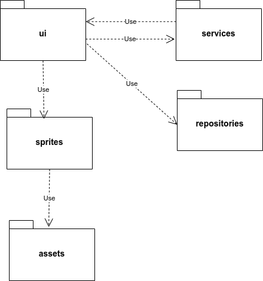
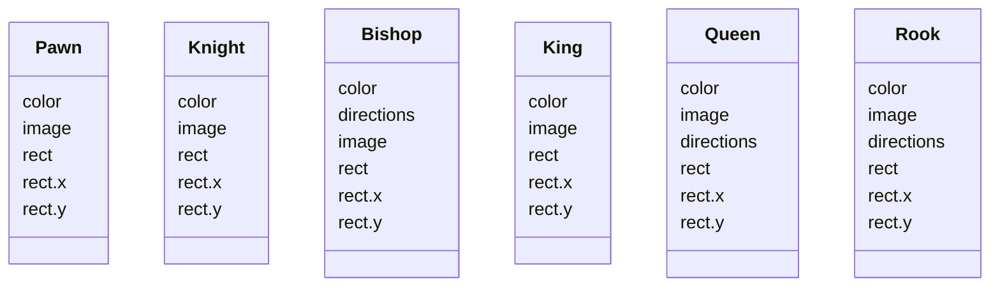
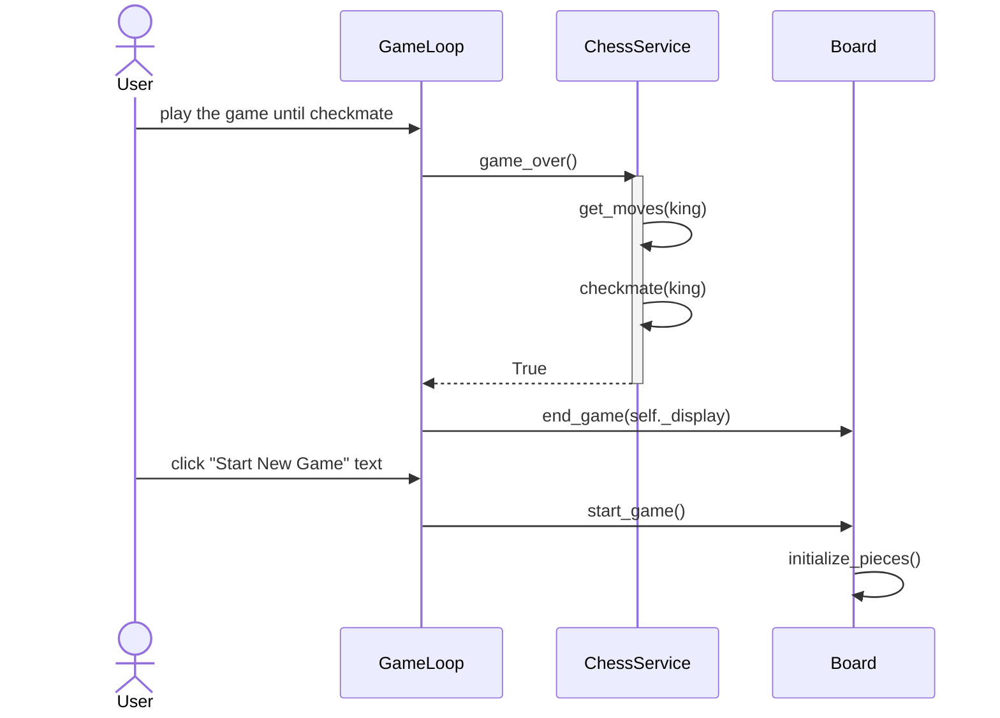

## Arkkitehtuurikuvaus

### Rakenne

Projektilla on seuraavanlainen pakkausrakenne:



Pakkaus _ui_ sisältää käyttöliittymän koodin, _services_ sovelluslogiikan koodin ja _repositories_ tietojen tallennuksesta vastaavan koodin. _sprites_ pakkaus sisältää luokat pelissä tarvittaville nappuloille, ja _assets_ pakkaus sisältää kuvat, joista nappulat piirretään. 

### Sovelluslogiikka

Pelin nappuloita kuvaavat Pygamen Sprite-luokan perivät luokat _Pawn_, _Knight_, _Bishop_, _King_, _Queen_ ja _Rook_:



Pelin logiikasta vastaa luokka _ChessService_, joka tarjoaa metodit pelitilanteen tarkistamiseen ja nappuloiden liikuttamiseen shakin sääntöjen mukaisesti. Esimerkiksi

- ```choose_piece(x, y)``` valitsee pelaajan klikkaamassa kohdassa olevan nappulan
- ```choose_option(x, y)``` siirtää valitun nappulan pelaajan klikkaamaan ruutuun
- ```check_game_over()``` tarkistaa joka siirron jälkeen päättyikö peli

Liikutettavat nappulat _ChessService_ saa käyttöliittymästä vastaavan _ui_ pakkauksen pelisilmukan koodin sisältävän _GameLoop_ luokan kautta. Kaikkiin nappuloihin _ChessService_ pääsee käsiksi eri tilanteiden tarkistamista varten _ui_ pakkauksen _Board_ luokan kautta, joka alustaa nappulat pelaajan valitsemaan asetelmaan. Pelaajan syöttämän tai tallentaman asetelman _Board_ luokka saa _GameLoop_ luokan kautta tietojen tallennuksesta vastaavalta _repositories_ pakkauksen _FENRepository_ luokalta.

Edellä mainittujen luokkien suhdetta kuvaava luokka/pakkauskaavio:


### Sekvenssikaavio uuden pelin aloituksesta pelin päättyessä

Kun peli päättyy, pelaajalla on mahdollisuus aloittaa uusi peli klikkaamalla pelilaudalle ilmestyvää "Start New Game" tekstiä.


