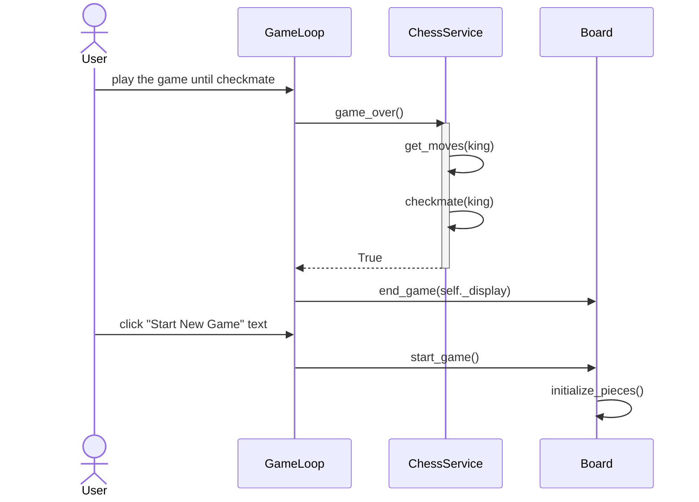

### Sekvenssikaavio uuden pelin aloituksesta pelin päättyessä

Kun peli päättyy, pelaajalla on mahdollisuus aloittaa uusi peli klikkaamalla pelilaudalle ilmestyvää "Start New Game" tekstiä.

```mermaid
sequenceDiagram
  actor User
  participant GameLoop
  participant ChessService
  participant Board
  User->>GameLoop: play the game until checkmate
  GameLoop->>ChessService: game_over()
  activate ChessService
  ChessService ->> ChessService: get_moves(king)
  ChessService->>ChessService: checkmate(king)
  ChessService-->>GameLoop: True
  deactivate ChessService
  GameLoop->>Board: end_game(self._display)
  User ->> GameLoop: click "Start New Game" text
  GameLoop ->> Board: start_game()
  Board->>Board: initialize_pieces()
```