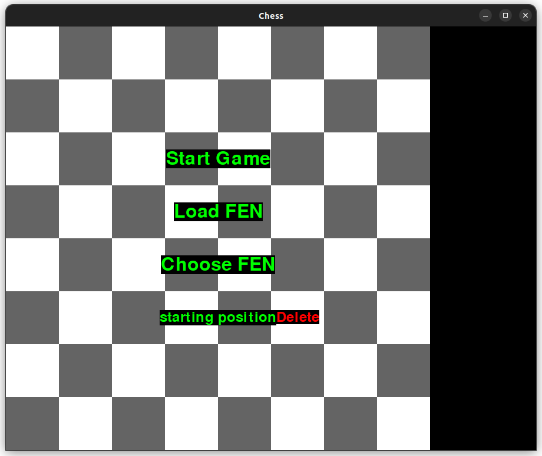
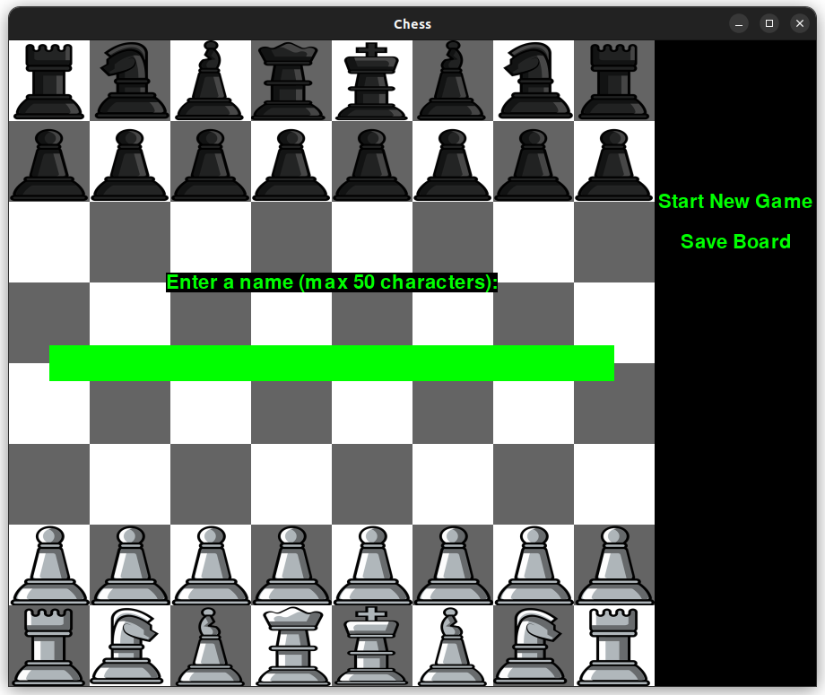
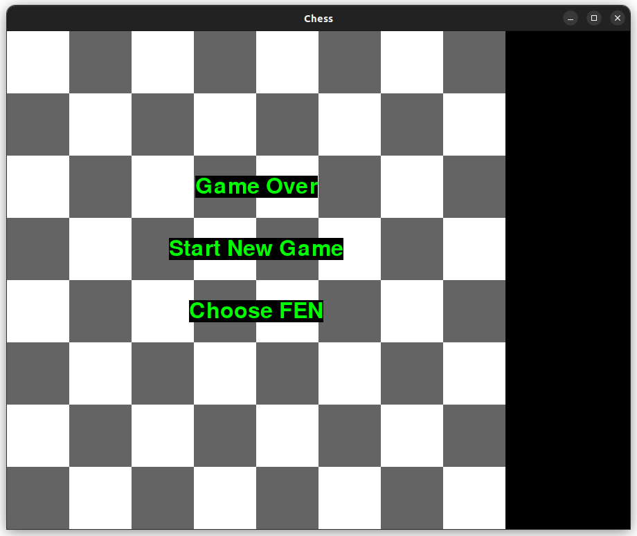

# Käyttöohje

Sovelluksen saa käyttöön lataamalla viimeisimmän [releasen](https://github.com/sakorh/ot-harjoitustyo/releases) lähdekoodin.

## Pelin käynnistäminen

Varmista ensin, että olet pygame-chess hakemistossa.

Asenna tarvittavat riippuvuudet
 ```
poetry install
 ```
Nyt sovelluksen voi käynnistää komennolla
```
poetry run invoke start
```

### Pelin aloitus

Sovellus käynnistyy aloitusnäkymään:


Klikkaamalla "Start Game" tekstiä peli käynnistyy shakin aloitusasetelmaan.

### FEN-asetelman syöttö

Klikkaamalla aloitusnäkymän "Load FEN" tekstiä pelilaudan voi alustaa omalla asetelmallaan.


Kun asetelma on syötetty, peli käynnistyy annettuun asetelmaan Enteriä painamalla. Pelilaudalla voi liikkua sekä näppäimistön nuolinäppäimillä, että hiirellä klikkailemalla. Näppäimistöltä nappulan voi valita Enterillä.

### Asetelman valitseminen tietokannasta

Klikkaamalla aloitusnäkymän "Choose FEN" tekstiä pelilaudan voi alustaa tietokantaan tallennetusta asetelmasta. Jos tietokannassa ei ole yhtään tallennettua asetelmaa, näyttää sovellus asianmukaisen ilmoituksen. Asetelman vieressä olevasta "Delete" napista painamalla asetelman voi poistaa tietokannasta.



### Pelilaudan asetelman tallennus

Pelin ollessa käynnissä pelilaudan asetelman voi tallentaa klikkaamalla pelilaudan vieressä olevaa "Save Board" tekstiä. Näkymän saa piiloon klikkaamalla "Save Board" tekstiä uudelleen. Asetelmalle ei voi antaa sellaista nimeä, joka on jo tallennettuna tietokantaan.



### Uuden pelin aloitus

Pelin ollessa käynnissä tai pelin päätyttyä takaisin sovelluksen alkunäkymään pääsee klikkaamalla "Start New Game" tekstiä. Pelin päätyttyä uuden asetelman voi myös valita tietokannasta "Choose FEN" tekstiä klikkaamalla.


