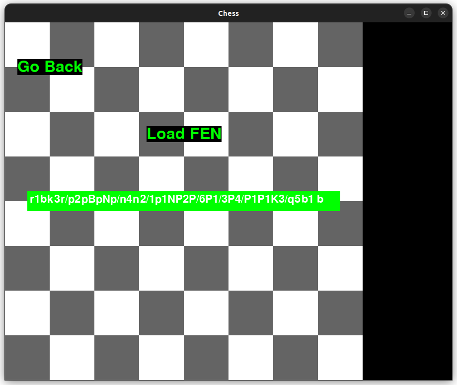

# Käyttöohje

## Pelin käynnistäminen

Varmista ensin, että olet pygame-chess hakemistossa.

Asenna tarvittavat riippuvuudet
 ```
poetry install
 ```
Nyt sovelluksen voi käynnistää komennolla
```
poetry run invoke start
```

## Pelin aloitus

Sovellus käynnistyy aloitusnäkymään:


Klikkaamalla "Start Game" tekstiä peli käynnistyy shakin aloitusasetelmaan.

## FEN-asetelman syöttö

Klikkaamalla aloitusnäkymän "Load FEN" tekstiä pelilaudan voi alustaa omalla asetelmallaan.



Kun asetelma on syötetty, peli käynnistyy annettuun asetelmaan Enteriä painamalla. Pelilaudalla voi liikkua sekä näppäimistön nuolinäppäimillä, että hiirellä klikkailemalla. Näppäimistöltä nappulan voi valita Enterillä.