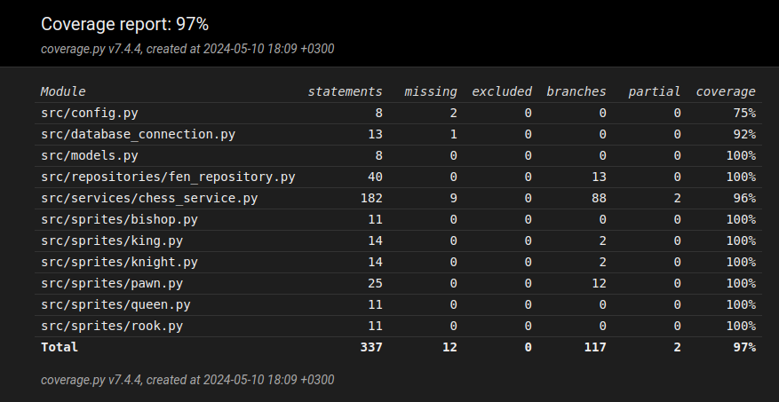

# Testausdokumentti

Sovellusta on testattu automatisoiduilla yksikkö- ja integraatiotesteillä sekä manuaalisesti järjestelmätasolla.

## Yksikkö- ja integraatiotestaus

### Sovelluslogiikka

Pelin logiikasta vastaavaa ```ChessService```-luokkaa on testattu ```TestChessService```-luokalla. Testeissä ```ChessService```-olio alustetaan injektoimalla sille riippuvuudeksi ```Board```-luokan olio, jonka kautta nappuloihin pääsee käsiksi.

### Repositorio-luokka

Tietokantaoperaatioista vastaavaa ```FENRepository```-luokkaa testataan ```TestFENRepository```-luokassa luomalla erillinen testitietokanta, jonka nimi on konfiguroitu ```.env.test```-tiedostoon.

### Testikattavuus

Käyttöliittymän koodia lukuunottamatta sovelluksen testien haaraumakattavuus on 97%



Testaamatta jäi mm. tilanne, jossa ```.env```-tiedostoa ei löytynyt, ja ```ChessService```-luokan *initialize_game*-metodi.

## Järjestelmätestaus

Järjestelmätasolla sovellusta on testattu manuaalisesti. 

### Asennus ja konfigurointi

Sovellus on ladattu ja testattu käyttöohjeen mukaisesti Linux-ympäristössä. Sovellusta on testattu tilanteessa, jossa tietokantatiedostoja ei ole ollut olemassa ja ohjelma on luonut ne itse, sekä tilanteissa, joissa ne ovat olleet olemassa.

### Toiminnallisuudet

Kaikki vaatimusmäärittelyssä määritellyt toiminnallisuudet on testattu. Niitä toiminnallisuuksia, jotka sisältävät käyttäjän syöttämää tekstiä, on testattu myös virheellisillä syötteillä.