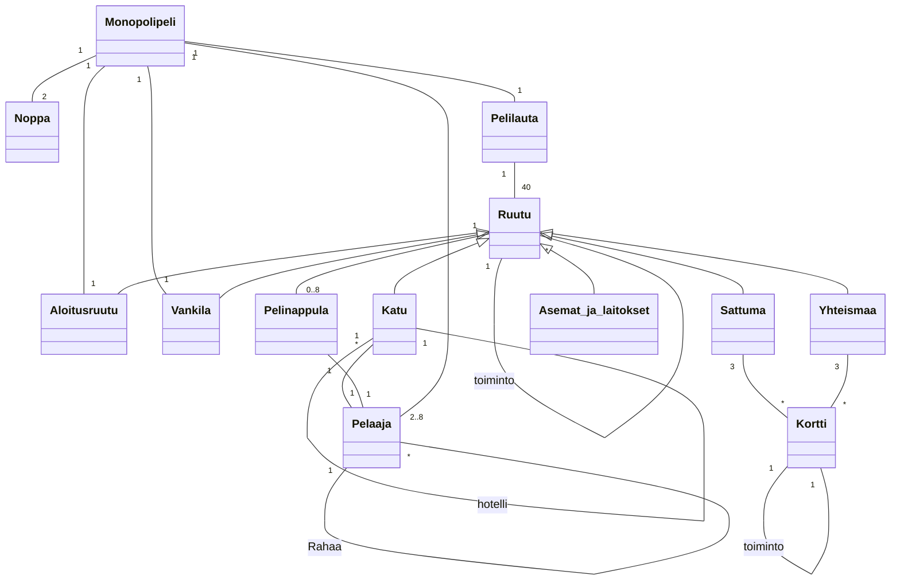

```mermaid
 classDiagram
    Monopolipeli "1" -- "2" Noppa
    Monopolipeli "1" -- "1" Pelilauta
    Pelilauta "1" -- "40" Ruutu
    Monopolipeli "1" -- "1" Aloitusruutu
    Monopolipeli "1" -- "1" Vankila
    Ruutu "1" -- "1" Ruutu: seuraava
    Ruutu "1" -- "*" Ruutu: toiminto
    Ruutu "1" -- "0..8" Pelinappula
    Ruutu  <|--  Aloitusruutu
    Ruutu <|-- Sattuma
    Ruutu <|-- Yhteismaa
    Ruutu <|-- Katu
    Ruutu <|-- Vankila
    Ruutu <|-- Asemat_ja_laitokset
    Sattuma "3" -- "*" Kortti
    Yhteismaa "3" -- "*" Kortti
    Kortti "1" -- "1"Kortti:toiminto
    Katu "1" -- "1" Katu: nimi
    Katu "1" -- "4" Katu: talo
    Katu "1" -- "1" Katu: hotelli
    Katu "*" -- "1" Pelaaja
    Pelinappula "1" -- "1" Pelaaja
    Pelaaja "1" -- "*" Pelaaja: Rahaa
    Pelaaja "2..8" -- "1" Monopolipeli
```